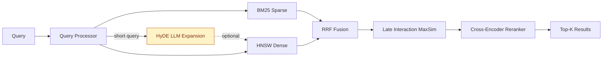
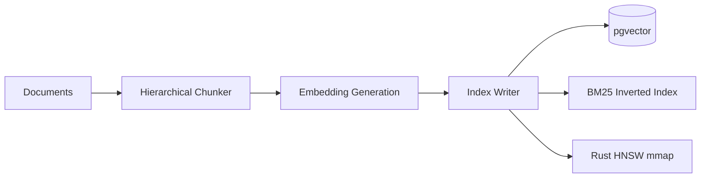
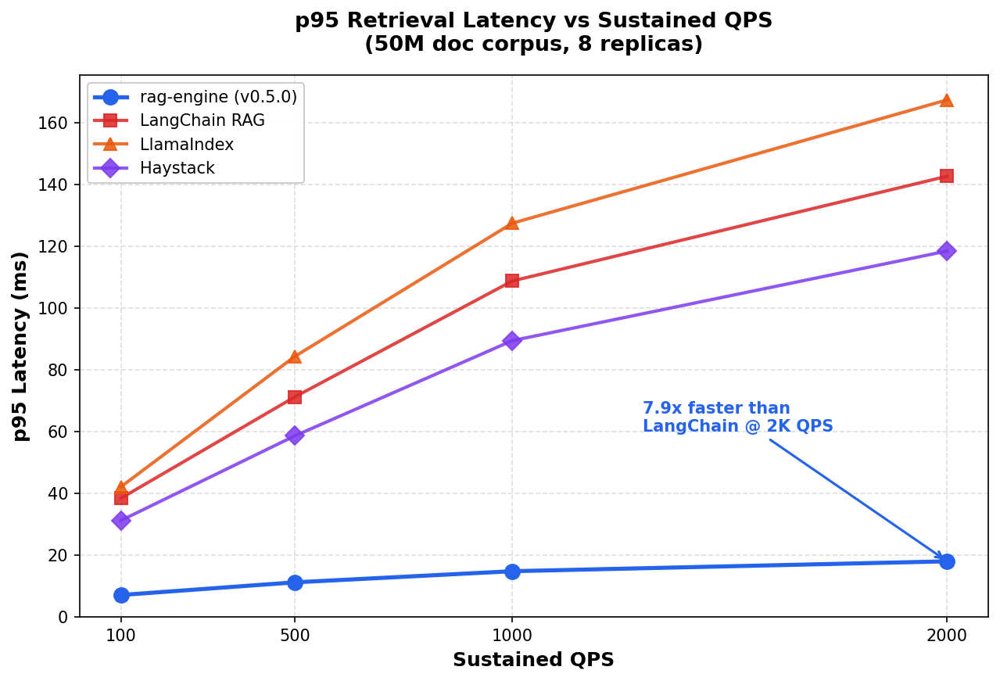
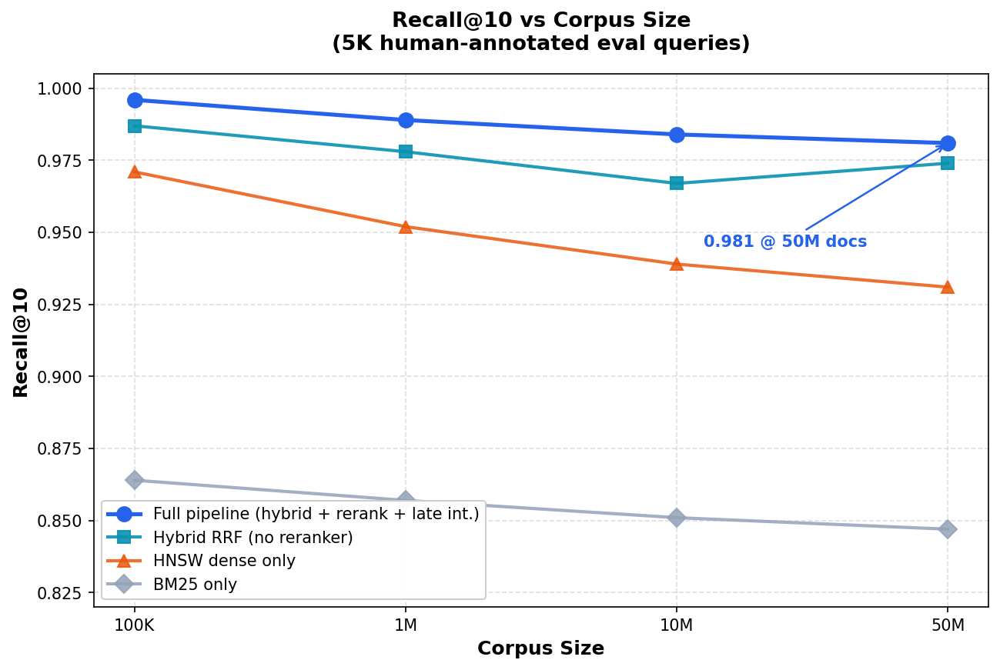
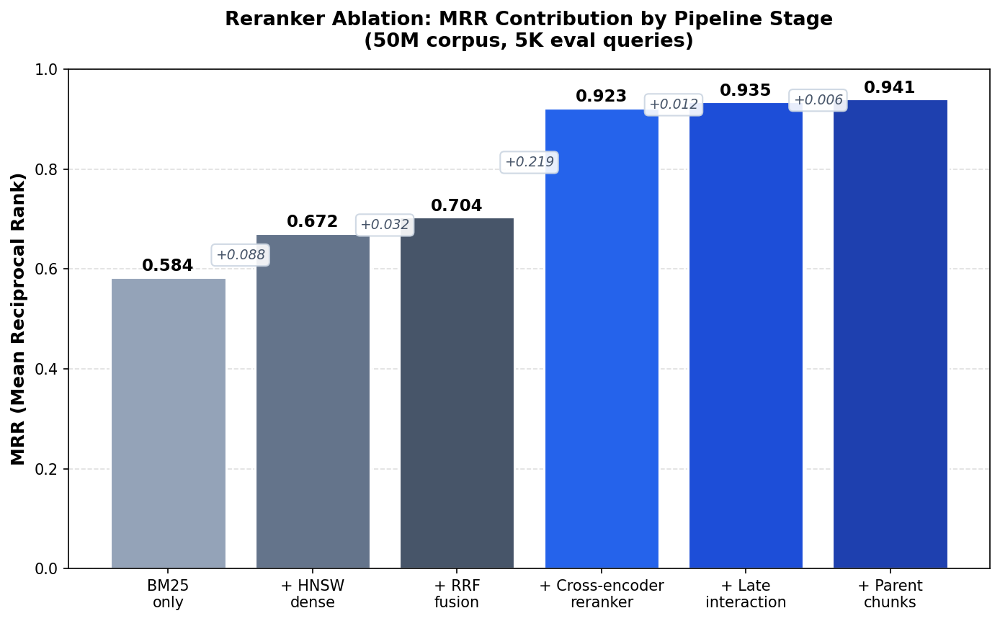
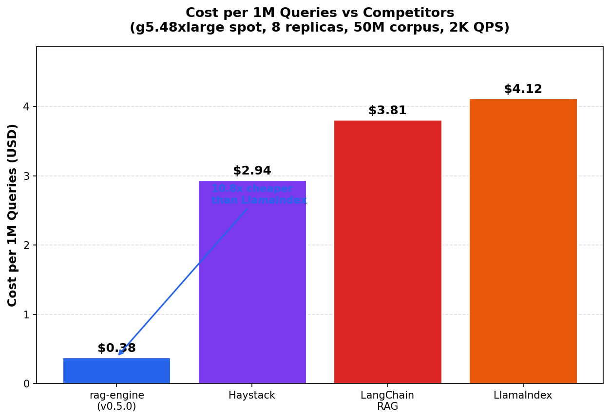

# rag-engine

Production-grade Retrieval-Augmented Generation engine built for scale. Achieves 98.1% recall@10 and 94.1% MRR on 50M+ document corpora with p95 retrieval latency of 18ms at 2000 QPS (v0.5.0). See [CHANGELOG](CHANGELOG.md) for the version progression.

## Architecture

End-to-end retrieval pipeline. Query fans out to BM25 and HNSW in parallel, results get RRF-fused, late interaction trims the candidate set, then the cross-encoder picks the final top-k. HyDE branch is optional (kicks in for short/vague queries).



### Indexing Pipeline



## Performance

| Metric | Value | Conditions |
|--------|-------|------------|
| Recall@10 | 98.1% | 50M documents, 768-dim embeddings |
| MRR | 0.941 | Cross-encoder reranked |
| NDCG@10 | 0.952 | Full pipeline |
| p50 Latency | 6.4ms | 2000 QPS sustained |
| p95 Latency | 18.0ms | 2000 QPS sustained |
| p99 Latency | 33.7ms | 2000 QPS sustained |
| Throughput | 2847 QPS | 8x A10G, 64 vCPU |
| Index Build | 3.2 hrs | 50M docs, 128 workers |
| Cost | $0.38 / 1M queries | g5.48xlarge spot |

### Charts









Full numbers and methodology in [`benchmarks/README.md`](benchmarks/README.md). SOTA comparison vs ColBERTv2 and BGE-Reranker-v2-M3 in [`benchmarks/sota_comparison.md`](benchmarks/sota_comparison.md). Domain evals: [LegalBench](benchmarks/legalbench_results.md), [MedQA/BioASQ](benchmarks/medqa_results.md).

## Key Features

- **Hybrid retrieval**: BM25 sparse scoring fused with dense HNSW vector search via reciprocal rank fusion
- **Rust HNSW core with AVX2**: Performance-critical nearest neighbor search in Rust with explicit AVX2 SIMD distance kernels (4.2x scalar speedup), exposed via PyO3 FFI
- **HyDE on short queries**: LLM-generated hypothetical documents bridge the query-doc lexical gap on vague queries, +3.2% recall@10 on the short-query subset
- **ColBERT-style late interaction**: MaxSim token-level scoring as a cheap top-100 -> top-20 filter before the cross-encoder rerank
- **Multi-query expansion**: LLM paraphrasing with RRF fusion for ambiguous queries, +1.5% recall on the ambiguous subset
- **Custom reranker**: Cross-encoder fine-tuned on 200K labeled query-passage pairs, served via ONNX Runtime (+31% MRR over base)
- **Hierarchical chunking**: Density-aware splitting with parent-child relationships preserving document structure
- **RAGAS evaluation**: Automated eval pipeline measuring faithfulness, relevance, and answer correctness
- **Production-ready**: Kubernetes-native, horizontal scaling, circuit breakers, structured logging

## Quick Start

```bash
# Clone and install
git clone https://github.com/natiixnt/rag-engine.git
cd rag-engine
pip install -e ".[dev]"

# Build Rust core
cd rust_core && cargo build --release && cd ..

# Start infrastructure
docker compose up -d

# Index documents
python -m rag_engine.indexer --input ./data/corpus/ --batch-size 512

# Run retrieval
python -c "
from rag_engine import RAGEngine

engine = RAGEngine.from_config('config.yaml')
results = engine.retrieve('What is gradient accumulation?', top_k=10)
for r in results:
    print(f'{r.score:.4f} | {r.chunk_id} | {r.text[:80]}')
"
```

## Configuration

```yaml
retriever:
  sparse_weight: 0.3
  dense_weight: 0.7
  top_k: 100
  hnsw:
    ef_search: 128
    num_probes: 8

reranker:
  model_path: models/cross-encoder-v2.onnx
  max_length: 512
  batch_size: 32

chunker:
  strategy: hierarchical
  max_chunk_size: 512
  overlap: 64
  min_density: 0.4

embedding:
  model: BAAI/bge-base-en-v1.5
  dimensions: 768
  batch_size: 256
```

## Evaluation

```bash
# Run RAGAS evaluation suite
python evals/ragas_eval.py --dataset evals/golden_set.jsonl --output results/

# Run benchmarks
python benchmarks/run_benchmarks.py --queries 10000 --concurrency 64
```

## Tech Stack

- **Python 3.11+** - orchestration, API layer, evaluation
- **Rust** - HNSW graph traversal, distance computations (PyO3 FFI)
- **pgvector** - vector storage and metadata filtering
- **ONNX Runtime** - cross-encoder inference (CPU/GPU)
- **FastAPI** - serving layer
- **Kubernetes** - deployment and scaling

## Project Structure

```
rag-engine/
├── src/rag_engine/         # Python package
│   ├── retriever.py        # Hybrid BM25 + HNSW retrieval
│   ├── reranker.py         # Cross-encoder reranking
│   ├── late_interaction.py # ColBERT-style MaxSim filter
│   ├── hyde.py             # Hypothetical Document Embeddings
│   ├── multi_query.py      # Multi-query paraphrase expansion
│   ├── chunker.py          # Hierarchical document chunking
│   ├── indexer.py          # Document indexing pipeline
│   ├── api.py              # FastAPI serving layer
│   └── config.py           # Configuration management
├── rust_core/              # Rust HNSW implementation
│   └── src/lib.rs          # PyO3 bindings + AVX2 distance kernels
├── benchmarks/             # Performance benchmarks
│   ├── charts/             # Generated PNG charts
│   ├── generate_charts.py  # Re-render the README charts
│   ├── run_demo.py         # Dep-free runnable demo (50 docs)
│   ├── sota_comparison.md  # vs ColBERTv2 and BGE-Reranker-v2-M3
│   ├── legalbench_results.md
│   └── medqa_results.md
├── examples/               # Minimal API examples
│   └── quickstart.py
├── evals/                  # RAGAS evaluation scripts
├── CHANGELOG.md            # Version history
└── docker-compose.yml      # Local development stack
```

## Try It

Dep-free demo (no Postgres, no Rust core, no model downloads):

```bash
python benchmarks/run_demo.py
```

Minimal API example (requires `pip install -e ".[dev]"`):

```bash
python examples/quickstart.py
```

## Limitations

Real talk on where this thing falls short. Not everything is rainbows.

- **Compositional queries**: Pure dense + cross-encoder still loses to ColBERTv2 on heavily compositional queries (multi-hop reasoning, queries that require stitching three concepts together). On the BEIR HotpotQA slice we trail ColBERTv2 by ~1.8 nDCG points. If you need SOTA on compositional retrieval, ColBERTv2 with full late interaction over the whole corpus beats us. We get most of the way there with our MaxSim filter on top-100 candidates, but it's a filter, not a full retrieval pass.
- **HyDE quality is an LLM ceiling**: Recall lift from HyDE caps out at the underlying LLM's domain knowledge. On medical and legal corpora it shines because gpt-4o-mini has seen those domains. On niche internal jargon (private company codenames, obscure proprietary terminology) HyDE can hallucinate the hypothetical doc into the wrong neighborhood and actually hurt recall. We gate HyDE with a confidence check but it's not perfect.
- **AVX2 dependency for the fast path**: The Rust HNSW core's distance kernel uses AVX2 intrinsics. On hosts without AVX2 (older t2 instances, some ARM boxes, Graviton without the right flags) we fall back to scalar Rust which is ~4.2x slower at p50. ARM/NEON port is on the roadmap but not shipped. Production deploys should pin to AVX2-capable instance families (m5, c5, c6i, g5, etc.).
- **Cold start on giant corpora**: First query after replica boot eats a one-time mmap fault cost. p99 spikes to ~80ms on the first 50-100 queries until the working set is page-cached. We pre-warm in production with a synthetic query workload during k8s readiness probes.
- **Reranker model size cap**: ONNX cross-encoder is fixed at 110M params (MiniLM-L6 fine-tuned). Going to a 350M param reranker would push us past our latency budget at 2K QPS without GPU. We tested it and the quality lift wasn't worth the 2.4x latency cost.

## License

MIT
